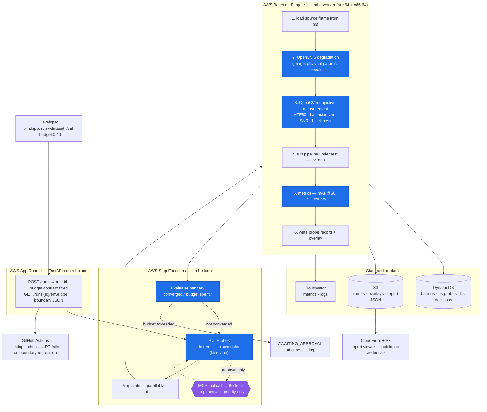
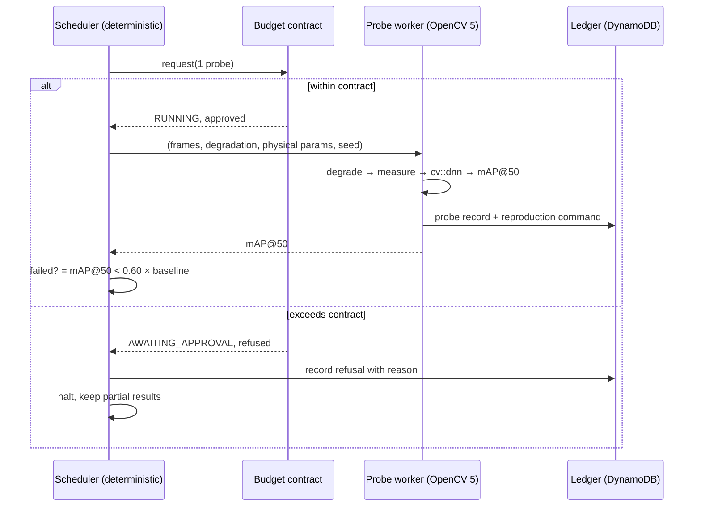

# Architecture

The diagram source is committed here as text, not only as an image, so it can
be diffed and corrected. The rendered version is generated from this source.

## System

Blue nodes are the judgment path: degradation, measurement, metrics, boundary
decisions and budget accounting. They are deterministic and cannot import an
LLM client. The single purple node is the only place a model is consulted, and
it may only propose which axis to spend remaining budget on — the scheduler
decides whether to accept, and records the rejection when it does not.

## Probe lifecycle

## Current implementation status

| Component | Status |
|---|---|
| OpenCV 5 degradation kernels (7 axes) and composite conditions | Implemented, tested |
| Objective degradation measurement | Implemented, tested |
| `cv::dnn` pipelines: YOLOX-S, YOLOX-Nano, NanoDet-Plus | Implemented, tested |
| mAP@50 / IoU metrics, one shared matching rule | Implemented, tested |
| 1-D boundary search (bisection, verified mode) | Implemented, measured |
| 2-D boundary search (level-set estimation) | Implemented, tested on synthetic surfaces |
| Coverage / uncovered regions (population response) | Implemented, tested |
| Budget contract, round planner, planner Lambda adapter | Implemented, tested |
| Probe worker, local JSONL and DynamoDB ledgers | Implemented, tested |
| Worker image, arm64 and x86-64 | Built locally; arm64 reproduces native results exactly |
| CDK stack (VPC, S3, DynamoDB, Batch x2, Step Functions, Lambda, Budgets) | Synthesised and tested; **not deployed** |
| Report schema and static viewer | Implemented, rendered locally; **not hosted** |
| COOL on Graviton comparison | Not built |
| MCP agent + decision ledger (agent side) | Not built |
| sim-to-real gap | **Not measured** |

Rows marked not deployed, not hosted, not built or not measured are not
described anywhere in this repository as though they exist.

## Design decisions worth stating

**The boundary is an interval, not a point.** Its width is the residual
uncertainty the probe budget bought. A point estimate would claim precision
nobody paid for.

**Bisection is checked, not trusted.** It assumes monotonicity, which detectors
do not guarantee. The verified mode scans before it refines, because a failure
band strictly inside the swept range leaves both endpoints passing and pure
bisection would report "no boundary" after two probes.

**Degradation is a pure function of `(image, params, seed)`.** This is what
lets a report cite a failing condition by recipe instead of shipping pixels,
and what lets a reader regenerate it byte-for-byte.

**The ledger is the only state.** The planner is a pure function of the run
definition and the probe ledger, and it replays the local search rather than
reimplementing it, so a cloud run and a local run visit the same probes.

**One shutter, two effects.** In the 2-D map a single exposure time sets both
the motion-blur length and the light the sensor collects, so the map never
probes a camera that cannot exist.

**The budget cannot be raised mid-run.** A limit the running code can lift is
not a limit, and an agent that can widen its own budget has none.
