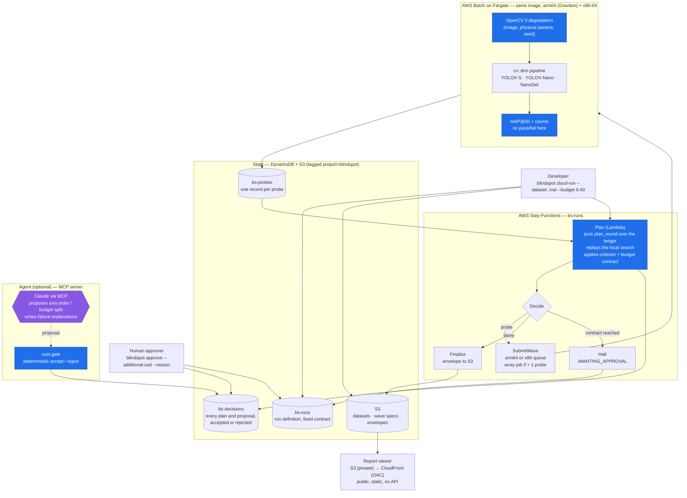
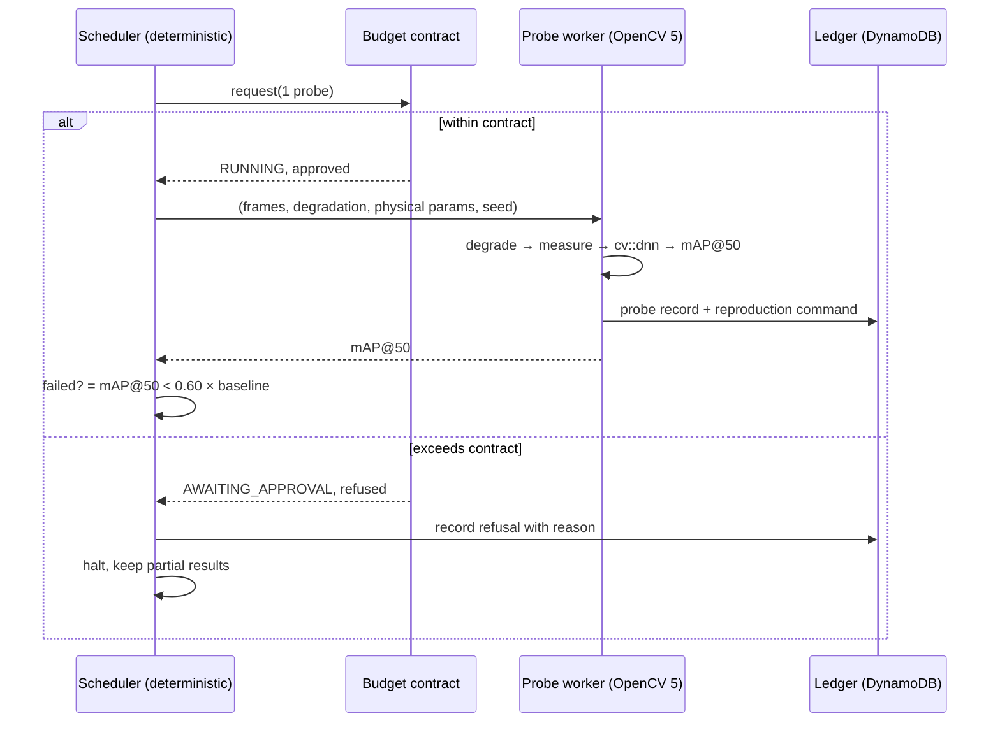

# Architecture

The diagram source is committed here as text, not only as an image, so it can
be diffed and corrected. The rendered version is generated from this source.

## System

Rendered: [`architecture-1.png`](architecture-1.png) (system), [`architecture-2.png`](architecture-2.png) (probe lifecycle), regenerated from the text below by `uv run python tools/render_architecture.py`.

Blue nodes are the judgment path: planning, degradation, measurement and the
proposal gate. They are deterministic and cannot import an LLM client (enforced
by `tests/test_no_llm_in_judgment.py`). The single purple node is the only
place a model is consulted; it may propose an axis order or a split of the
remaining budget, and the gate accepts or rejects each proposal, recording
both. Nothing that runs under the budget contract can raise it; only a
recorded human approval can.

The stack is defined in `infra/`, synth-tested, and deployed; runs so far used the Graviton queue.

## Probe lifecycle

## Current implementation status

| Component | Status |
|---|---|
| OpenCV 5 degradation kernels (7 axes) and composite conditions | Implemented, tested |
| Objective degradation measurement | Implemented, tested |
| `cv::dnn` pipelines: YOLOX-S, YOLOX-Nano, NanoDet-Plus | Implemented, tested |
| mAP@50 / IoU metrics, one shared matching rule | Implemented, tested |
| 1-D boundary search (bisection, verified mode) | Implemented, measured |
| 2-D boundary search (level-set estimation) | Implemented, tested on synthetic surfaces |
| Coverage / uncovered regions (population response) | Implemented, tested |
| Budget contract, round planner, planner Lambda adapter | Implemented, tested |
| Probe worker, local JSONL and DynamoDB ledgers | Implemented, tested |
| Worker image, arm64 and x86-64 | **Deployed** on both Fargate queues; every layer verified by `tools/verify_images.py` |
| CDK stack (VPC, S3, DynamoDB, Batch x2, Step Functions, Lambda, dashboard) | **Deployed**; full run, budget halt and the approval path verified on AWS (Graviton queue; the test approval was issued by automation) |
| Report schema and static viewer | **Hosted** on CloudFront from a private S3 bucket (https://d18du1w0ii5yhw.cloudfront.net/); opens without credentials, independent of the control plane |
| COOL on Graviton comparison | **Measured** on EC2 (three arms, `bench/ec2_cool.py`); not part of the workers |
| MCP agent + decision ledger (agent side) | **Deployed path**: `cloud-run --agent` on Bedrock (Haiku), decisions in `bs-decisions`, model cost charged to the contract; three live runs |
| sim-to-real gap | **Not measured** |

Rows marked not deployed, not hosted, not built or not measured are not
described anywhere in this repository as though they exist.

## Design decisions worth stating

**The boundary is an interval, not a point.** Its width is the residual
uncertainty the probe budget bought. A point estimate would claim precision
nobody paid for.

**Bisection is checked, not trusted.** It assumes monotonicity, which detectors
do not guarantee. The verified mode scans before it refines, because a failure
band strictly inside the swept range leaves both endpoints passing and pure
bisection would report "no boundary" after two probes.

**Degradation is a pure function of `(image, params, seed)`.** This is what
lets a report cite a failing condition by recipe instead of shipping pixels,
and what lets a reader regenerate it byte-for-byte.

**The ledger is the only state.** The planner is a pure function of the run
definition and the probe ledger, and it replays the local search rather than
reimplementing it, so a cloud run and a local run visit the same probes.

**One shutter, two effects.** In the 2-D map a single exposure time sets both
the motion-blur length and the light the sensor collects, so the map never
probes a camera that cannot exist.

**The budget cannot be raised mid-run.** A limit the running code can lift is
not a limit, and an agent that can widen its own budget has none.
