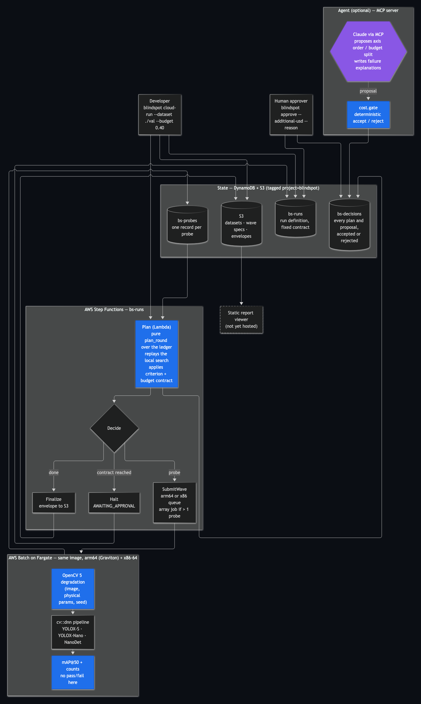

# Blindspot — technical report

**Find where your vision pipeline starts lying.**

Every measured figure in this report is cited to the benchmark output that
produced it and checked by `uv run python tools/check_doc_numbers.py`. Anything
not yet measured says so.

## 1. Problem

A detector's accuracy is reported as a single number — mAP@50 = 0.61, say —
with no statement of the capture conditions under which it holds. Exposure
time, camera motion, illuminance, fog, compression: none of it is in the model
card. So the first time a team learns the operating limit of their pipeline is
usually in the field, and it rarely announces itself. The failure this project
is built around is the *confident* wrong answer. On a street frame blurred
past the boundary, YOLOX-S reports a bus as a car at
0.83 <!--bench:frames/frames[0].frame.max_fp_score--> confidence. Nothing in
the output distinguishes it from a correct detection.

## 2. Users

Small teams that ship vision pipelines to cameras they do not fully control —
edge devices, vehicles, fixed installations — and who have a labelled
validation set of around a hundred images but no budget for a full field
campaign. Blindspot takes the pipeline and that set and returns:

- the **conditions the validation set never covered**, first;
- **failure boundaries in physical units** — milliseconds of exposure, lux,
  extinction coefficient, JPEG quality — that can be compared against a camera
  spec sheet;
- for every boundary, the **command that regenerates it** byte-for-byte.

It is a tool that interrogates detectors, not a detector.

## 3. Architecture

Source and design decisions: [`architecture.md`](architecture.md).

The judgment path — degradation, measurement, metrics, boundary location,
budget accounting and the gate on agent proposals — is deterministic code that
cannot import an LLM client; `tests/test_no_llm_in_judgment.py` walks the
transitive import graph of those packages and fails if one is reachable,
including a self-test that it catches a planted violation.

The search runs the same way locally and in the cloud. Locally, a bisection
walks each axis from its benign end to its severe end. In the cloud, a planner
Lambda is a pure function of the run definition and the probe ledger that
*replays* that same local search and stops at the first probe it needs; a test
requires the cloud plan to visit exactly the probes the local search visits.

## 4. OpenCV 5 implementation

OpenCV 5.0.0 (`opencv-python-headless==5.0.0.93`) does the substantive work at
every stage.

**Degradation**, each a pure function of `(image, physical parameters, seed)`:

| Axis | Physical model | OpenCV 5 |
|---|---|---|
| Motion blur | PSF length `f_px · tan(ω·t)` from exposure time and angular velocity; sub-pixel line PSF | `filter2D` |
| Defocus | Thin-lens circle of confusion; uniform disc PSF, anti-aliased | `filter2D` |
| Lens distortion | Brown-Conrady `k1, k2, p1, p2`, verified by a <1 px roundtrip | `initUndistortRectifyMap`, `remap`, `undistortPoints`, `projectPoints` |
| Rolling shutter | Per-row displacement from readout time and angular velocity | `remap` |
| Fog | Koschmieder: `I = J·t + A(1−t)`, `t = exp(−β·d)`, β in 1/m | array ops |
| Low light | lux → photons → Poisson shot noise → Gaussian read noise → gain → full-well clip | — (numpy RNG seeded) |
| JPEG | libjpeg quality; byte-identical to a plain `imencode` at the same setting | `imencode`, `imdecode` |

Degradations compose in the order light travels — atmosphere, optics,
sensor, codec — with an independent seed per step, and the 2-D map ties blur
and light to a single shutter time so it never probes a camera that cannot
exist.

**Objective measurement** of what a condition actually did to a frame:
Laplacian variance (`Laplacian`), RMS contrast, SNR from Immerkær's noise
estimator (`filter2D`), JPEG blockiness on the 8-px grid, and a spectral MTF50
proxy.

**Pipelines under test** run through `cv::dnn` (`readNetFromONNX`,
`blobFromImage`, `NMSBoxes`): YOLOX-S, YOLOX-Nano and NanoDet-Plus-m, all
Apache-2.0, with aspect-preserving letterbox preprocessing.

**Evidence and privacy**: overlays are drawn with OpenCV, and faces are found
with YuNet via `FaceDetectorYN` and blurred at render time, after scoring.

**Determinism** is enforced by a registry-driven test suite: same seed gives
byte-identical output, no kernel reads or writes numpy's global RNG, and
results match across processes and under a changed `PYTHONHASHSEED`. Across
operating systems on the same CPU family the results are bit-identical: the
Graviton cloud run reproduced the macOS run's numbers exactly. Across CPU
families they are not. Running the same full search on x86 and on Graviton
Fargate tasks, 18 <!--bench:cloud_runs/cross_arch.identical_map50_full_precision-->
of 33 probes matched to full precision and the rest differed by at most
0.000142 <!--bench:cloud_runs/cross_arch.max_abs_map50_difference--> mAP --
floating-point paths in OpenCV and `cv::dnn` differ between the two CPUs. Every
pass/fail decision agreed, so both runs chose the same probes and reported the
same boundaries; the closest probe was
0.0058 <!--bench:cloud_runs/cross_arch.smallest_margin_to_threshold--> from the
threshold. A probe nearer to the threshold than that gap could fall on
different sides on the two CPUs.

## 5. AWS deployment

Defined in CDK (`infra/`), tested at synth time, and **deployed** to a
dedicated account profile with its own CDK bootstrap qualifier. A full
four-axis run on 100 frames took 14 min 41 s on the Graviton queue and cost
$0.0749 <!--bench:cloud_runs/20261005-132343-667165-cost.total_usd--> measured
from ECS's billed task time, against a $0.40 contract; its boundaries are
identical to the local benchmark's.

- **Step Functions** loop: Plan (Lambda) → Decide → SubmitWave → Plan; Finalize
  writes the envelope; Halt marks the run `AWAITING_APPROVAL`.
- **AWS Batch on Fargate**, two queues with the same worker image: arm64
  (Graviton) and x86-64, each capped at 16 vCPU. Single-probe waves run as
  plain jobs because Batch array jobs need at least two children.
- **DynamoDB** ledgers: `bs-runs`, `bs-probes` (one record per probe),
  `bs-decisions` (every plan and proposal, accepted or rejected).
- **S3** for datasets, wave specs and envelopes; public access blocked, TLS
  enforced.
- **Report viewer**: the static Next.js export is deployed by the same stack
  to a private S3 bucket and served by CloudFront through origin access
  control, at https://d18du1w0ii5yhw.cloudfront.net/. No credentials and no
  API: the page and its report JSON are files, so the report stays readable
  when the control plane is down. Cache is a five-minute max-age rather than
  an invalidation, because CDK grants invalidation on `Resource: "*"`.
- **Cost shape**: public subnets only, no NAT gateway and no interface
  endpoints; on-demand tables; one-week logs; a 25 USD Budgets alarm filtered
  to the project tag (the alarm is created when a notification address is
  supplied at deploy time; it has not been yet). Estimated fixed cost is under
  1 USD a month.
- **Observability**: the planner publishes per-round metrics (probes
  completed, contract spent, axes located, wave size, halts) in CloudWatch
  Embedded Metric Format, graphed on the `bs-runs` dashboard with run
  outcomes.
- **Hygiene**: every resource tagged `project=blindspot`, named `bs-*`, and
  bootstrapped with its own CDK qualifier. Synth tests fail on an untagged
  resource, a NAT gateway, or an IAM statement on `Resource: "*"` beyond a
  listed set AWS itself requires — and on any unused entry in that list.

**Agent (opt-in).** `blindspot cloud-run --agent` runs Claude Haiku on
Bedrock (`claude-haiku-4-5`, the model this account can call) over the MCP
tools before the loop starts. It may propose an axis order and per-axis probe
caps; `cost.gate` decides each proposal and every decision is written to
`bs-decisions`. Each model call is priced from its token usage and charged to
the run's contract immediately, so the gate always sees what the agent has
spent. A split the contract cannot pay for creates the run in
`AWAITING_APPROVAL`, and `blindspot approve` resumes it. A capped axis is
reported as unresolved, never as a boundary. In the live run the agent's
split did not bind, the boundaries matched the plain run, and the run cost
$0.0883 <!--bench:cloud_runs/20261005-210213-0a71ee-cost.total_usd--> including
$0.0126 <!--bench:cloud_runs/20261005-210213-0a71ee-cost.bedrock_usd--> of model calls.

**A documented agent error.** In run `20261005-205745-0109b4` the agent
justified its probe split with: "This allocation reduces the largest gaps in
the validation set." That is wrong. Coverage describes the user's validation
set, the conditions it was actually captured under; probing synthetic
conditions cannot change it. Its split was also irrelevant to the search,
which located every boundary in 8 <!--bench:cloud_runs/20261005-205745-0109b4-envelope.findings[0].probes_used-->
probes per axis however generous the caps. The error cost nothing because the
agent cannot act on its reasoning: the gate checks only that a proposal is a
valid permutation or a split the contract can pay for, and the planner, not
the agent, decides what is measured and what fails. The case is kept as the
clearest illustration of why the model proposes and deterministic code
decides.

## 6. Evaluation

Validation set `road100`: 100 COCO val2017 frames, 984 objects, filtered to
licences that permit derivative works and commercial use. Failure: mAP@50
below 60% of the pipeline's own undegraded baseline.

**Where YOLOX-S fails, one axis at a time** (baseline mAP@50
0.6111 <!--bench:efficiency.baseline.mAP50-->):

| Axis | Boundary |
|---|---|
| Exposure (60 deg/s pan) | 12.50 <!--bench:efficiency.axes[0].levels[3].grid.lower-->–13.75 <!--bench:efficiency.axes[0].levels[3].grid.upper--> ms |
| Illuminance | 12.98 <!--bench:efficiency.axes[1].levels[3].grid.lower-->–25.47 <!--bench:efficiency.axes[1].levels[3].grid.upper--> lux |
| Fog β | 0.06 <!--bench:efficiency.axes[2].levels[3].grid.lower-->–0.0638 <!--bench:efficiency.axes[2].levels[3].grid.upper--> /m |
| JPEG quality | 7.97 <!--bench:efficiency.axes[3].levels[3].grid.lower-->–10.94 <!--bench:efficiency.axes[3].levels[3].grid.upper--> |

**Probe savings.** A grid must double its probes to halve boundary
uncertainty; bisection needs one more. So savings depends on the precision
asked for, and both ends are reported: 1.00× <!--bench:efficiency.summary.by_grid_level.5.mean_savings_verified-->
at 5 grid points and 4.12× <!--bench:efficiency.summary.by_grid_level.33.mean_savings_verified-->
at 33. On all four axes verified bisection returned the grid's own interval
with zero error.

**Two axes at once.** On the exposure x illuminance map, 273 <!--bench:hook_grid.n_failed-->
of 289 conditions fail. The map's blur edge overlaps the independent 1-D
boundary, and at 10.75 ms and 49.5 lux — inside each axis's 1-D envelope — the
combined condition fails (mAP 0.2950 <!--bench:hook_grid.cells[5][4].map50-->):
one-axis envelopes overstate the safe region. Level-set estimation classified
all 289 cells correctly with 22 <!--bench:levelset_efficiency.primary.probes_used-->
probes, 13.14× <!--bench:levelset_efficiency.primary.savings--> fewer, on a map
that is 94% failing, which favours the method.

**Model dependence.** NanoDet-Plus-m on the same frames has the same blur edge
but fails in fog at about half the extinction coefficient
(0.03 <!--bench:efficiency_road100_nanodet_plus_m.axes[2].levels[3].grid.lower--> /m).

**Coverage.** The undegraded road100 frames cover
17.4% <!--bench:coverage.by_axis.motion_blur:exposure_ms--> of the probed
motion-blur range, 30.1% <!--bench:coverage.by_axis.fog:beta_per_m--> of fog,
23.9% <!--bench:coverage.by_axis.jpeg:quality--> of JPEG quality and
88.4% <!--bench:coverage.by_axis.low_light:illuminance_lux--> of illuminance,
inferred from image statistics against the population's response.

**On AWS.** The deployed run reproduced all four boundaries exactly, and a
deliberately starved $0.02 contract stopped after four probes in
`AWAITING_APPROVAL`; `blindspot approve` resumed it under contract version 2
and it completed. That approval was issued by the project's automation for the
test, under the operator's name, not by a person deciding. Redeployed from a fresh clone by following only
the README, it reproduced the same boundaries for
$0.0752 <!--bench:cloud_runs/20261005-165654-d03e9b-cost.total_usd-->.

**x86 vs Graviton.** On the same image and probe batch, x86 Fargate tasks were
faster per frame (432.1 <!--bench:cool/fargate_x86_vs_arm64.arms.x86.per_frame_total_median_ms--> ms against
497.4 <!--bench:cool/fargate_x86_vs_arm64.arms.arm64.per_frame_total_median_ms--> ms on Graviton4) and Graviton
was cheaper per frame ($0.01091 <!--bench:cool/fargate_x86_vs_arm64.arms.arm64.usd_per_1000_frames--> against
$0.01185 <!--bench:cool/fargate_x86_vs_arm64.arms.x86.usd_per_1000_frames--> per 1,000). OpenCV's own stages
were faster on Graviton; inference was faster on x86. Fargate placed the x86
tasks on two CPU generations, so the x86 figure is a median over different
hardware (`docs/results.md`).

**COOL.** On the same c8g.large and the same probe batch, the Cloud Optimized
OpenCV build (`5.1.0-dev`) ran at 0.928 <!--bench:cool/ec2_three_way.cool_effect.speedup--> of the
stock OpenCV 5 wheel's speed: slightly faster image measurement, slower DNN
inference, same mAP on 63 <!--bench:cool/ec2_three_way.cool_effect.map50_identical_probes--> of 64 probes.
The chip effect is separate: x86 (c7i) ran Graviton4 at
0.728 <!--bench:cool/ec2_three_way.chip_effect.speedup--> of its speed (`docs/results.md`).

**Not measured:** the sim-to-real gap (section 7).

## 7. Limitations

1. **Synthetic degradation is not real degradation, and the gap is not
   measured.** A real low-light, hand-shake and recompression capture set is
   needed; until then boundaries describe modelled conditions only.
2. **Bit-identity holds within a CPU family, not across.** x86 and Graviton
   agree on every decision measured so far but differ in the low decimal
   places of mAP; a condition sitting on the threshold could be classified
   differently on each.
3. **COOL is measured on one workload only.** One detector, one instance size,
   one probe batch; COOL was slower here, which says nothing about the image
   operations it targets in isolation. It runs as an EC2 AMI, outside the
   Fargate workers.
4. **Bisection assumes monotonicity.** Verified mode scans first and reports
   `NOT_MONOTONE`, but a failure band narrower than the scan spacing can be
   missed; the cheap mode misses interior bands entirely, which a test pins.
5. **Two axes at most, one pair.** Other pairs and higher-dimensional
   interactions are unexplored.
6. **Coverage is inferred from image statistics**, not capture metadata, and
   fog depth is a ground-plane ramp.
7. **Three pipelines, two families**, all COCO-trained detectors.
8. **No H.264 CRF axis.** OpenCV 5's `VideoWriter` exposes no rate control in
   this build; an invented mapping would be a fabricated unit.

## 8. Responsible use

- **Data licences.** Only COCO images whose licence permits derivative works
  and commercial use are used, since every probe is a derivative work. Pixels
  are fetched, not redistributed, except for a handful of evidence frames,
  which are CC BY 2.0 and credited individually.
- **People.** Faces are blurred at render time with YuNet, after scoring, so
  anonymisation cannot move a number. Frames in which people are the subject —
  half or more of the labelled objects — are not shown at all; an earlier rule
  had selected a photograph of children, which is why this rule exists.
  Automatic face detection can miss faces, so frames are also reviewed by eye.
- **What is claimed.** Blindspot reports the behaviour of a pipeline on stated
  data under modelled conditions. It does not certify a pipeline as safe, and
  the report opens with what was *not* tested.
- **Agency.** A model may propose which axis to probe next and how to split the
  remaining budget; deterministic code accepts or rejects every proposal and
  records both. No model decides pass or fail, where a boundary is, or what
  anything cost, and only a named human can raise a run's budget.
